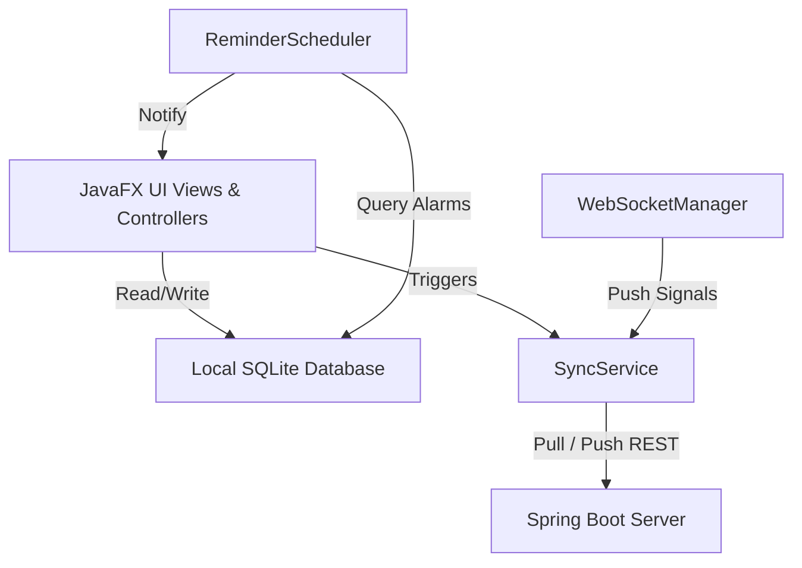

# 🗓️ Reminder Desktop — Windows Client

[](https://www.oracle.com/java/)
[](https://openjfx.io/)
[](https://www.sqlite.org/)
[](LICENSE)

An elegant, modern Windows desktop application for the **Reminder Ecosystem**. Built using **Java 21**, **JavaFX 21**, and **SQLite**, it offers desktop alerts, offline-first operation, real-time bi-directional synchronization, and installer packaging.

---

## 🏗️ Architecture & Sync Flow

The desktop application is designed with an **Offline-First MVC architecture**. It manages data locally using an SQLite database and asynchronously synchronizes with the Spring Boot Server backend using REST APIs and WebSockets.

### Core Architecture Overview



### Sync & Conflict Resolution Sequence (Last-Write-Wins)

When synchronizing local and server resources, the client compares the timestamp (`updatedAt`) to determine the source of truth, handling deletions with specific status states:

```mermaid
sequenceDiagram
    participant SQLite as SQLite Local DB
    participant Sync as SyncService
    participant API as Backend Server API
    
    rect rgb(200, 230, 255)
        note right of Sync: Phase 1: Deletions Propagation
        Sync->>SQLite: Query deleted records (DELETE_PENDING)
        SQLite-->>Sync: List of deleted IDs
        Sync->>API: HTTP DELETE /api/{resource}/{id}
        API-->>Sync: HTTP 200 OK / 404 Not Found
        Sync->>SQLite: Purge deleted records from DB
    end
    
    rect rgb(220, 255, 220)
        note right of Sync: Phase 2: Pull & Merge (Last-Write-Wins)
        Sync->>API: HTTP GET /api/{resource}
        API-->>Sync: List of server records with updatedAt
        loop For each server record
            Sync->>SQLite: Query local record
            alt Record exists and Server updatedAt > Local updatedAt
                Sync->>SQLite: Overwrite local data & sync status (SYNCED)
            alt Record does not exist locally
                Sync->>SQLite: Insert new record as (SYNCED)
            end
        end
    end
    
    rect rgb(255, 230, 200)
        note right of Sync: Phase 3: Push Pending Modifications
        Sync->>SQLite: Query modified records (PENDING)
        SQLite-->>Sync: List of local modifications
        loop For each local modification
            alt Server ID is Null
                Sync->>API: HTTP POST /api/{resource} (Create)
            else
                Sync->>API: HTTP PUT /api/{resource}/{serverId} (Update)
            end
            API-->>Sync: Synced record with Server ID & updatedAt
            Sync->>SQLite: Update status to (SYNCED) & save serverId
        end
    end
```

---

## ✨ Features Breakdown

*   **📊 Unified Dashboard**: A streamlined start page offering summaries of pending items:
    *   Active checklist items count
    *   Upcoming timed reminders
    *   Pending and overdue payment trackings
*   **📝 Quick Notes**: Light checklists with checkboxes. Supports drag-and-drop or visual ordering, local addition, deletion, and real-time syncing.
*   **⏰ Timed Reminders**: Desktop alert system with custom message and snooze timers. Triggers notifications using the native OS notification system.
*   **💳 Payment Trackers**: A dedicated utility for managing monthly bills and recurring payments with custom schedules (Monthly, Weekly, Yearly) and payment logging.
*   **🎨 Theme Management**: Built-in support for Dark Mode. Themes are dynamically applied across all views by [ThemeManager](file:///m:/ReminderWindows/src/main/java/com/reminder/desktop/ui/ThemeManager.java).
*   **🔄 Bi-directional Synchronization**:
    *   **REST Clients**: Uses [ApiClient](file:///m:/ReminderWindows/src/main/java/com/reminder/desktop/sync/ApiClient.java) with JSON mapping via Jackson.
    *   **WebSockets**: Uses [WebSocketManager](file:///m:/ReminderWindows/src/main/java/com/reminder/desktop/sync/WebSocketManager.java) for real-time notifications to trigger background syncs when server modifications occur.
    *   **Offline-First & Resilience**: Retries sync operations using an **Exponential Backoff** retry algorithm (5s to 300s) on connection failures.

---

## 🛠️ Tech Stack & File References

| Technology | Purpose | Key File Links |
| :--- | :--- | :--- |
| **Java 21** | Main Programming Language | [Launcher.java](file:///m:/ReminderWindows/src/main/java/com/reminder/desktop/Launcher.java) |
| **JavaFX 21** | UI Presentation Framework | [MainApplication.java](file:///m:/ReminderWindows/src/main/java/com/reminder/desktop/MainApplication.java) \| [ThemeManager.java](file:///m:/ReminderWindows/src/main/java/com/reminder/desktop/ui/ThemeManager.java) |
| **SQLite** | Local Relational Database | [DatabaseManager.java](file:///m:/ReminderWindows/src/main/java/com/reminder/desktop/database/DatabaseManager.java) |
| **Maven** | Dependency & Build Tool | [pom.xml](file:///m:/ReminderWindows/pom.xml) |
| **WiX Toolset v3** | Installer Compilation Packages | [build-installer.ps1](file:///m:/ReminderWindows/build-installer.ps1) |

---

## 🚀 Getting Started

### Prerequisites

Ensure you have the following installed:
*   **JDK 21** (or higher) configured in your environment path.
*   **Maven 3.8+** (or use the packaged `./mvnw.cmd` wrapper).
*   **WiX Toolset v3.14+** (if building the `.msi`/`.exe` packages).

### 1. Configuration

By default, the client points to a placeholder endpoint. Set your backend host:
*   Via user interface inside the **Server URL** input field on the login/register screen.
*   By modifying the fallback server URL in code: [ServerConfig.java](file:///m:/ReminderWindows/src/main/java/com/reminder/desktop/config/ServerConfig.java).
*   See [CONFIGURATION.md](file:///m:/ReminderWindows/CONFIGURATION.md) for full configuration, databases directories, and file permissions.

### 2. Compilation and Run

To run in development mode with hot reload features enabled:
```bash
./mvnw.cmd javafx:run
```

To run test suites:
```bash
./mvnw.cmd test
```

To bundle the application into a compiled executable JAR:
```bash
./mvnw.cmd clean package -DskipTests
```
The resulting JAR will be available at: `target/ReminderWindows-1.0-SNAPSHOT.jar`.

### 3. Creating Windows Installers (`.msi` / `.exe`)

A PowerShell script is provided to automate bundling dependencies, resolving Java runtime packaging (using `jpackage`), and compile-linking installers via the WiX Toolset.

Run the build script:
```powershell
Set-ExecutionPolicy Bypass -Scope Process
.\build-installer.ps1
```

The script will:
1. Automatically download and configure the standalone **WiX Toolset v3.14** if not found.
2. Compile and package the application with Maven.
3. Bundle dependencies and use `jpackage` to generate ready-to-run installers at:
   `target/installer/Reminder-1.2.0.msi` and `target/installer/Reminder-1.2.0.exe`.

---

## 🔒 Security Summary

*   **Token Storage**: Active authentication JSON Web Tokens (Access and Refresh tokens) are saved inside the `{user.home}/.reminder_desktop.properties` configuration file in plain text.
*   **Access Management**: Restrict system users from accessing your home directory if running on a shared computer environment. Future iterations will adopt Windows DPAPI encryption.
